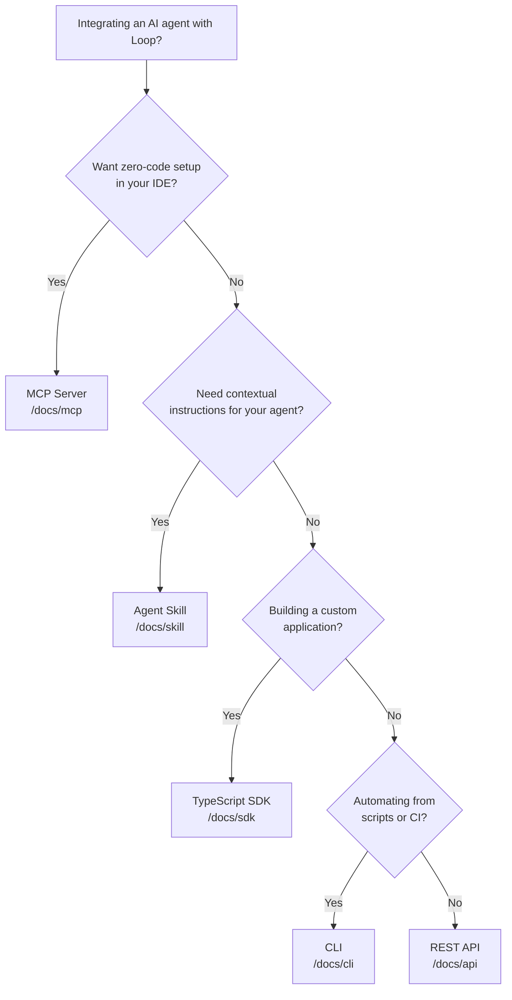

import { Cards, Card } from 'fumadocs-ui/components/card';
import { Callout } from 'fumadocs-ui/components/callout';

# Agent Integration

Loop integrates with AI agents through multiple surfaces. Choose the one that fits your workflow, or follow a per-agent guide below.

## Decision Tree

Use this diagram to pick the right integration surface for your use case.

## Per-Agent Guides

Step-by-step setup instructions for specific AI agents and IDEs.

<Cards>
  <Card
    title="Claude Code"
    description="One-command MCP setup, agent skill loading, and end-to-end dispatch walkthrough."
    href="/docs/agents/claude-code"
  />
  <Card
    title="Cursor"
    description="Configure .cursor/mcp.json and load Cursor rules for Loop-aware AI assistance."
    href="/docs/agents/cursor"
  />
  <Card
    title="Windsurf"
    description="Set up MCP integration in Windsurf with .windsurf/mcp.json configuration."
    href="/docs/agents/windsurf"
  />
  <Card
    title="OpenHands"
    description="Load the Loop microagent and configure MCP for autonomous development with OpenHands."
    href="/docs/agents/openhands"
  />
  <Card
    title="Custom / Any Agent"
    description="Generic integration pattern for any AI agent that can make HTTP calls — SDK, CLI, or raw REST API."
    href="/docs/agents/custom"
  />
</Cards>

## Integration Surfaces

Loop provides five integration surfaces. Most setups combine two or more.

**[MCP Server](/docs/mcp)** — Zero-code IDE integration via the Model Context Protocol. Install in one command, and your agent gets 9 tools for claiming tasks, creating issues, ingesting signals, and more.

**[TypeScript SDK](/docs/sdk)** — Programmatic access to Loop for custom applications, agent frameworks, and scripts. Type-safe client with resource-based API.

**[Agent Skill](/docs/skill)** — Contextual instructions packaged as a content-only npm module. Teaches AI agents how to use Loop effectively by providing a SKILL.md (or equivalent) that the agent reads for context.

**[CLI](/docs/cli)** — Command-line interface for managing issues, signals, triage, templates, and dispatch from scripts or CI pipelines.

**[REST API](/docs/api)** — Direct HTTP access for any language or platform. Every other surface (MCP, SDK, CLI) communicates through this API.

<Callout title="Best practice" type="info">
  Install both the MCP Server (for tools) and the Agent Skill (for knowledge) to give your agent the best experience. The MCP server provides actions the agent can take, while the skill provides instructions the agent reads for context.
</Callout>
