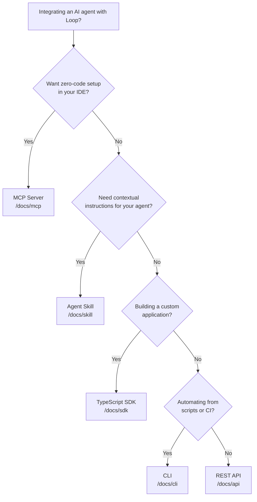
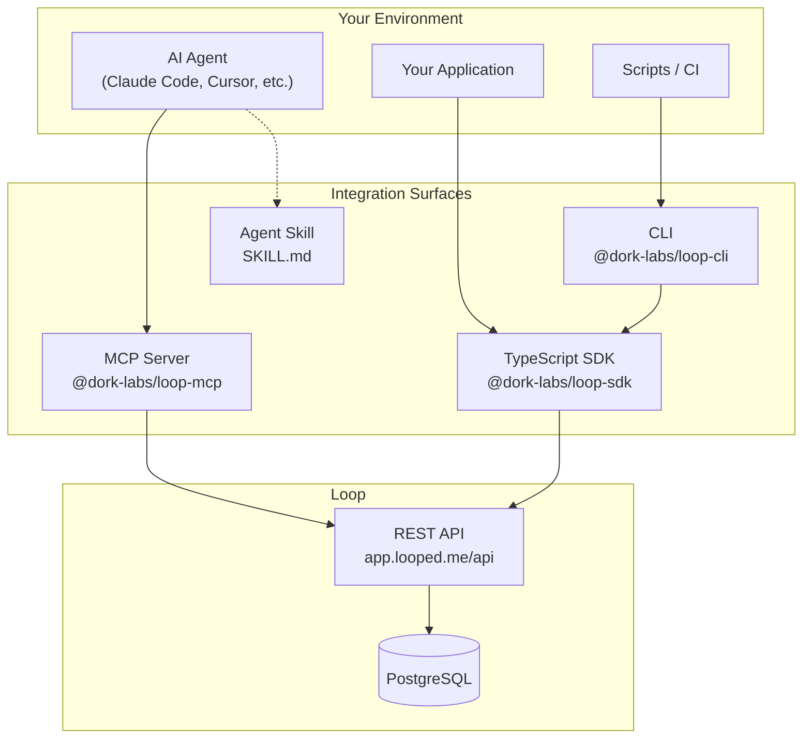

# Specification: Documentation Update — Agent Integration Surfaces

**Status:** Draft
**Author:** Claude Code
**Date:** 2026-02-23
**Spec:** specs/docs-agent-integration/02-specification.md
**Ideation:** specs/docs-agent-integration/01-ideation.md
**Parent:** specs/agent-integration-strategy.md (Feature 7)

---

## Overview

Update Loop's Fumadocs documentation site to cover all six agent integration surfaces shipped in Phase 1-2 of the agent integration strategy. This adds ~33 new MDX pages across 4 new doc sections (agents/, mcp/, sdk/, skill/) and updates ~8 existing pages, bringing the documentation from covering 2-of-7 integration surfaces to full coverage.

The documentation architecture follows the **Additive Structure with Diátaxis Principles** pattern: topic-based navigation at the sidebar level (how Stripe, Vercel, Supabase structure their docs) with Diátaxis quadrant discipline applied within each section (every page is clearly one of: tutorial, how-to, reference, or explanation).

---

## Background / Problem Statement

Loop now has seven distinct integration surfaces — REST API, TypeScript SDK, CLI, Connect CLI, MCP Server, Agent Skill, and per-agent guides — but the current documentation only covers the REST API (auto-generated), the original CLI commands (6 pages), and basic concepts. Developers approaching Loop from an agent context have no documentation for:

- How to install and configure the MCP server in their IDE
- How to use the TypeScript SDK programmatically
- How to load the Agent Skill for contextual instructions
- Which integration surface to use for their specific use case
- How to generate and manage `loop_`-prefixed API keys
- How the different integration surfaces relate architecturally

This gap means new users must reverse-engineer setup from source code, README files, and package.json scripts — a friction that directly contradicts Loop's goal of being "the easiest autonomous work management system for AI agents."

---

## Goals

- Document all 7 integration surfaces with a clear entry point for each
- Provide per-agent complete integration guides for Claude Code, Cursor, Windsurf, and OpenHands
- Create an `agents/` landing page with a decision tree that answers "which surface should I use?"
- Write hand-written SDK reference pages with runnable code examples for every resource
- Add tabbed MCP installation instructions following the Render/Stripe pattern
- Rewrite the Getting Started quickstart around the connect CLI flow
- Create a dedicated API key management page
- Add an architecture overview with Mermaid diagram showing how surfaces relate

---

## Non-Goals

- Building or modifying any integration surfaces (Features 1-6 are shipped)
- Marketing site content changes (Feature 8: separate spec)
- FTUE dashboard changes (Feature 9: separate spec)
- Blog posts, changelog entries, social media content
- Auto-generated TypeDoc output (hand-written per ADR 0031)
- Contributing/developer setup guides (separate concern)
- Python, Go, or other language SDK documentation
- Custom Fumadocs components or plugins (existing components suffice)

---

## Technical Dependencies

### Fumadocs Infrastructure (existing, no changes needed)

- `apps/web/source.config.ts` — MDX source config pointing to `../../docs`
- `apps/web/src/lib/source.ts` — Source loader with `/docs` baseUrl
- `apps/web/src/app/(docs)/docs/[[...slug]]/page.tsx` — Catch-all MDX renderer
- `apps/web/src/components/mdx-components.tsx` — Available components: `Step`, `Steps`, `Tab`, `Tabs`, `File`, `Files`, `Folder`, `TypeTable`, plus Fumadocs defaults (Cards, Card, Callout, code blocks)

### Source Packages (data sources for documentation content)

| Package | Version | What to document |
|---------|---------|-----------------|
| `@dork-labs/loop-mcp` | `packages/mcp/` | 9 agent tools, dual transport, .mcp.json config |
| `@dork-labs/loop-sdk` | `packages/sdk/` | LoopClient, 11 resource classes, error handling, pagination |
| `@dork-labs/loop-types` | `packages/types/` | Shared type definitions (entities, requests, responses) |
| `@dork-labs/loop` | `packages/loop-skill/` | SKILL.md, AGENTS.md template, Cursor rules, OpenHands microagent |
| `@dork-labs/loop-cli` | `apps/cli/` | CLI commands, auth, config |

### Related ADRs

| ADR | Title | Relevance |
|-----|-------|-----------|
| 0023 | Use `loop_` prefix for API keys | API key format in all auth docs |
| 0025 | Dual-transport MCP package | MCP architecture explanation |
| 0026 | Outcomes over operations tool design | MCP tool descriptions |
| 0028 | Content-only npm package for agent skill | Skill distribution model |
| 0030 | Progressive disclosure across discovery artifacts | Discovery layer explanation |
| 0031 | Hand-written SDK over generation | SDK docs approach |
| 0032 | Shared types package for API types | Types documentation strategy |

---

## Detailed Design

### Documentation Architecture

**Navigation structure:** 12 top-level sections in sidebar (up from 8).

```
docs/meta.json pages array (new order):
[
  "getting-started",     // existing, updated
  "concepts",            // existing, updated
  "agents",              // NEW — primary entry for agent users
  "mcp",                 // NEW — MCP server reference
  "sdk",                 // NEW — TypeScript SDK reference
  "skill",               // NEW — Agent Skill reference
  "cli",                 // existing, updated
  "guides",              // existing, updated
  "integrations",        // existing, updated
  "api",                 // existing, unchanged
  "self-hosting",        // existing, unchanged
  "contributing"         // existing, unchanged
]
```

The `agents/` section is positioned immediately after `concepts/` because it answers the most common new user question: "I'm building an agent — which integration surface do I use?"

### Complete File Manifest

#### New Files (33 files)

**agents/ section (7 files):**

| File | Type | Purpose |
|------|------|---------|
| `docs/agents/meta.json` | Nav config | Section: "Agent Integration" with 6 pages |
| `docs/agents/index.mdx` | Explanation | Decision tree (Mermaid diagram) + surface cards |
| `docs/agents/claude-code.mdx` | Tutorial | Complete Claude Code setup: API key → MCP → Skill → verify → first dispatch |
| `docs/agents/cursor.mdx` | Tutorial | Complete Cursor setup: API key → MCP → rules → verify → first dispatch |
| `docs/agents/windsurf.mdx` | Tutorial | Complete Windsurf setup: API key → MCP → verify → first dispatch |
| `docs/agents/openhands.mdx` | Tutorial | Complete OpenHands setup: API key → microagent → verify → first dispatch |
| `docs/agents/custom.mdx` | How-to | Generic HTTP poll pattern for any agent (curl + SDK examples) |

**mcp/ section (4 files):**

| File | Type | Purpose |
|------|------|---------|
| `docs/mcp/meta.json` | Nav config | Section: "MCP Server" with 3 pages |
| `docs/mcp/index.mdx` | How-to + Reference | Overview + tabbed installation (Claude Code, Cursor, Windsurf, Claude Desktop) |
| `docs/mcp/tools.mdx` | Reference | All 9 tools: name, description, parameters, example input/output |
| `docs/mcp/troubleshooting.mdx` | How-to | Common errors, .mcp.json debugging, environment variable issues |

**sdk/ section (11 files):**

| File | Type | Purpose |
|------|------|---------|
| `docs/sdk/meta.json` | Nav config | Section: "TypeScript SDK" with 10 pages |
| `docs/sdk/index.mdx` | Tutorial + Reference | LoopClient overview, installation, first call, resource map table |
| `docs/sdk/dispatch.mdx` | Reference | `dispatch.next()`, `dispatch.queue()` — the core agent workflow |
| `docs/sdk/issues.mdx` | Reference | `issues.list/get/create/update/delete` with code examples |
| `docs/sdk/signals.mdx` | Reference | `signals.ingest()` with typed payloads |
| `docs/sdk/projects.mdx` | Reference | Projects resource methods |
| `docs/sdk/goals.mdx` | Reference | Goals resource methods |
| `docs/sdk/templates.mdx` | Reference | Templates + versions + reviews |
| `docs/sdk/dashboard.mdx` | Reference | `dashboard.stats/activity/prompts` |
| `docs/sdk/errors.mdx` | Reference | Error classes, retry behavior, error handling patterns |
| `docs/sdk/comments.mdx` | Reference | Comments + relations resources |

**skill/ section (2 files):**

| File | Type | Purpose |
|------|------|---------|
| `docs/skill/meta.json` | Nav config | Section: "Agent Skill" with 1 page |
| `docs/skill/index.mdx` | How-to | What is the Loop agent skill vs MCP, install per editor, customization |

**New pages in existing sections (9 files):**

| File | Type | Purpose |
|------|------|---------|
| `docs/getting-started/api-keys.mdx` | Reference | API key generation, `loop_` prefix, rotation, security best practices |
| `docs/concepts/architecture.mdx` | Explanation | How MCP, SDK, CLI, REST API relate — Mermaid diagram |
| `docs/cli/auth.mdx` | Reference | `loop auth login/logout/status` |
| `docs/cli/dashboard.mdx` | Reference | `loop dashboard` |
| `docs/cli/labels.mdx` | Reference | `loop labels list/create/delete` |
| `docs/cli/completions.mdx` | Reference | Shell completions for bash/zsh/fish |
| `docs/guides/connect-cli.mdx` | Tutorial | `npx @dork-labs/loop-connect` walkthrough |
| `docs/guides/agent-polling-loop.mdx` | How-to | Building an autonomous agent polling loop |

#### Updated Files (8 files)

| File | Change |
|------|--------|
| `docs/meta.json` | Add `agents`, `mcp`, `sdk`, `skill` to pages array |
| `docs/index.mdx` | Add 4 new Cards for agents, mcp, sdk, skill sections |
| `docs/getting-started/meta.json` | Add `api-keys` to pages array |
| `docs/getting-started/index.mdx` | Rewrite with choose-your-path cards |
| `docs/getting-started/quickstart.mdx` | Rewrite: connect CLI → first issue → dispatch loop |
| `docs/getting-started/authentication.mdx` | Expand with `loop_` key format details |
| `docs/concepts/meta.json` | Add `architecture` to pages array |
| `docs/cli/meta.json` | Add `auth`, `dashboard`, `labels`, `completions` to pages array |
| `docs/guides/meta.json` | Add `connect-cli`, `agent-polling-loop` to pages array |
| `docs/integrations/index.mdx` | Add cross-links to agents/ section |

### Page Content Specifications

#### agents/index.mdx — Decision Tree Landing

**Content structure:**

1. Title: "Agent Integration"
2. Intro paragraph: Loop integrates with AI agents through multiple surfaces — choose the one that fits your workflow
3. Mermaid decision tree diagram:



4. Cards grid linking to per-agent guides: Claude Code, Cursor, Windsurf, OpenHands, Custom
5. Brief 1-2 sentence description of each integration surface with links

#### mcp/index.mdx — Tabbed Installation

**Content structure:**

1. Title: "MCP Server"
2. What is Loop's MCP server — 2-3 sentences
3. `<Tabs>` component with 4 tabs:

**Tab: Claude Code**
```bash
claude mcp add loop -- npx -y @dork-labs/loop-mcp
```
Set API key: `export LOOP_API_KEY=loop_your_key`

**Tab: Cursor**
Add to `.cursor/mcp.json`:
```json
{
  "mcpServers": {
    "loop": {
      "command": "npx",
      "args": ["-y", "@dork-labs/loop-mcp"],
      "env": { "LOOP_API_KEY": "loop_your_key" }
    }
  }
}
```

**Tab: Windsurf**
Add to MCP config (similar JSON structure, Windsurf-specific path)

**Tab: Claude Desktop**
Add to `claude_desktop_config.json` (platform-specific paths for macOS/Windows)

4. Verification step: "Ask your agent to run `loop_get_next_task`"
5. Environment variables table: `LOOP_API_KEY` (required), `LOOP_API_URL` (optional, defaults to https://app.looped.me)
6. Link to tools reference, troubleshooting, and `.mcp.json.example`

#### sdk/index.mdx — SDK Overview

**Content structure:**

1. Title: "TypeScript SDK"
2. Installation: `npm install @dork-labs/loop-sdk`
3. Quick start:
```typescript
import { LoopClient } from '@dork-labs/loop-sdk'

const loop = new LoopClient({
  apiKey: process.env.LOOP_API_KEY,
})

// Get the next task from the dispatch queue
const task = await loop.dispatch.next()
if (task) {
  console.log(task.issue.title)
  console.log(task.prompt)
}
```
4. Resource map table:

| Resource | Description | Key methods |
|----------|-------------|-------------|
| `loop.dispatch` | Core agent feedback loop | `next()`, `queue()` |
| `loop.issues` | Atomic units of work | `list()`, `get()`, `create()`, `update()`, `delete()` |
| `loop.projects` | Group issues by objective | `list()`, `get()`, `create()`, `update()`, `delete()` |
| `loop.goals` | Measurable success indicators | `list()`, `get()`, `create()`, `update()`, `delete()` |
| `loop.labels` | Categorical tags | `list()`, `create()`, `delete()` |
| `loop.signals` | External event ingestion | `ingest()` |
| `loop.comments` | Threaded issue discussion | `list()`, `create()` |
| `loop.relations` | Issue dependencies | `create()`, `delete()` |
| `loop.templates` | Versioned prompt instructions | `list()`, `get()`, `create()`, `update()`, `delete()` |
| `loop.reviews` | Prompt quality feedback | `create()` |
| `loop.dashboard` | System health metrics | `stats()`, `activity()`, `prompts()` |

5. Links to each resource page

#### SDK Resource Pages — Standard Template

Each SDK resource page (`sdk/dispatch.mdx`, `sdk/issues.mdx`, etc.) follows this structure:

1. **Title** — resource name
2. **Purpose** — 1 sentence
3. **Import + setup** — show `const loop = new LoopClient(...)` reminder
4. **Methods table** — name, parameters, return type, 1-line description
5. **Per-method sections:**
   - Method signature with TypeScript types
   - Description of what it does
   - Parameters table (name, type, required, description)
   - Code example (runnable, realistic data)
   - Return type with example response shape
6. **Error handling callout** — which errors this resource can throw
7. **Cross-links** — related API endpoints, MCP tools

#### Per-Agent Guides — Standard Template

Each agent guide (`agents/claude-code.mdx`, `agents/cursor.mdx`, etc.) follows this structure:

1. **Title** — "Loop + {Agent Name}"
2. **Prerequisites** — API key (link to api-keys.mdx)
3. **Step 1: Install MCP Server** — platform-specific command (cross-link to mcp/index.mdx)
4. **Step 2: Load Agent Skill** — if supported by the platform (cross-link to skill/index.mdx)
5. **Step 3: Verify Connection** — ask agent to run `loop_get_next_task`
6. **Step 4: Your First Dispatch Cycle** — create an issue → run `loop_get_next_task` → complete task
7. **Troubleshooting** — platform-specific common issues
8. **Next Steps** — links to SDK, CLI, dashboard, concepts

#### getting-started/quickstart.mdx — Rewritten

New flow:
1. **Get an API key** — from the dashboard or `npm run setup` (link to api-keys.mdx)
2. **Connect your project** — `npx @dork-labs/loop-connect` (single command, auto-detects environment)
3. **Create your first issue** — `loop.issues.create({ title: "...", type: "task" })` via SDK
4. **Run the dispatch loop** — `loop.dispatch.next()` returns the issue with instructions
5. **Complete the task** — report completion and see the loop in action

#### concepts/architecture.mdx — Architecture Overview

**Content structure:**

1. Title: "Architecture Overview"
2. How Loop's integration surfaces relate (Mermaid diagram):



3. Surface comparison table (when to use each)
4. Pull architecture explanation
5. The dispatch loop explained

### Navigation Config Changes

**`docs/meta.json`** — updated pages array:
```json
{
  "title": "Documentation",
  "pages": [
    "getting-started",
    "concepts",
    "agents",
    "mcp",
    "sdk",
    "skill",
    "cli",
    "guides",
    "integrations",
    "api",
    "self-hosting",
    "contributing"
  ]
}
```

**`docs/agents/meta.json`:**
```json
{
  "title": "Agent Integration",
  "pages": ["claude-code", "cursor", "windsurf", "openhands", "custom"]
}
```

**`docs/mcp/meta.json`:**
```json
{
  "title": "MCP Server",
  "pages": ["tools", "troubleshooting"]
}
```

**`docs/sdk/meta.json`:**
```json
{
  "title": "TypeScript SDK",
  "pages": ["dispatch", "issues", "signals", "projects", "goals", "templates", "dashboard", "comments", "errors"]
}
```

**`docs/skill/meta.json`:**
```json
{
  "title": "Agent Skill",
  "pages": []
}
```

**`docs/getting-started/meta.json`** — add `api-keys`:
```json
{
  "title": "Getting Started",
  "pages": ["quickstart", "authentication", "api-keys"]
}
```

**`docs/concepts/meta.json`** — add `architecture`:
```json
{
  "title": "Concepts",
  "pages": ["issues", "signals", "dispatch", "prompts", "projects-and-goals", "architecture"]
}
```

**`docs/cli/meta.json`** — add new commands:
```json
{
  "title": "CLI Reference",
  "pages": ["issues", "signals", "triage", "templates", "dispatch", "status", "auth", "dashboard", "labels", "completions"]
}
```

**`docs/guides/meta.json`** — add new guides:
```json
{
  "title": "Guides",
  "pages": ["dashboard", "writing-templates", "connect-cli", "agent-polling-loop"]
}
```

---

## User Experience

### Entry Points

1. **New user from marketing site** → Getting Started → Quickstart (connect CLI flow)
2. **Agent developer** → Agents → Decision tree → Per-agent guide (Claude Code, Cursor, etc.)
3. **SDK developer** → SDK → LoopClient overview → Resource pages
4. **Search / llms.txt** → Direct page landing via search or AI agent discovery

### Key User Journeys

**Journey 1: "I use Cursor, how do I connect to Loop?"**
1. Land on agents/index.mdx (via search or nav)
2. See decision tree → "Want zero-code setup in your IDE?" → MCP Server
3. Click "Cursor" card → agents/cursor.mdx
4. Follow complete setup: API key → MCP JSON config → verify → first dispatch
5. Done in ~5 minutes

**Journey 2: "I'm building a custom agent"**
1. Land on agents/index.mdx
2. Decision tree → "Building a custom application?" → TypeScript SDK
3. Click through to sdk/index.mdx
4. Install SDK, read LoopClient overview
5. Read sdk/dispatch.mdx for the core loop: `next()` → work → `complete()`
6. Reference individual resource pages as needed

**Journey 3: "I just signed up, what do I do?"**
1. Getting Started → Quickstart
2. Get API key → Connect project → Create first issue → Run dispatch → Complete task
3. Branch to per-agent guide or SDK reference based on their use case

---

## Testing Strategy

### Build Verification

- `npm run build` must succeed with all new pages (Fumadocs validates MDX at build time)
- All internal links resolve (Fumadocs reports broken links during build)
- No MDX compilation errors from malformed JSX in code examples

### Manual Verification

- Sidebar navigation shows all 12 sections in correct order
- All Cards on index.mdx link to correct pages
- Mermaid diagrams render correctly on agents/index.mdx and concepts/architecture.mdx
- `<Tabs>` component on mcp/index.mdx switches between Claude Code, Cursor, Windsurf, Claude Desktop
- `<Steps>` components on per-agent guides render numbered steps correctly
- Code examples have correct syntax highlighting (typescript, bash, json)
- All cross-links between sections work

### Content Accuracy Verification

- MCP tool names and parameters match `packages/mcp/src/tools/*.ts` source
- SDK resource methods and signatures match `packages/sdk/src/resources/*.ts` source
- CLI commands match `apps/cli/src/commands/*.ts` source
- `.mcp.json` config examples match `packages/mcp/.mcp.json.example`
- API key format (`loop_` prefix) matches implementation in `apps/api/src/env.ts`

### llms.txt Verification

- New pages appear in sitemap
- The llms.txt route at `apps/web/src/app/llms.txt/route.ts` discovers new pages (verify by hitting the endpoint after build)

---

## Performance Considerations

- **Build time:** ~33 new static MDX pages compile at build time. Linear scaling — no runtime impact. Expect ~5-10 seconds additional build time.
- **Page weight:** MDX compiles to static HTML. No client-side JavaScript added for documentation content. Mermaid diagrams render client-side — limit to 2 diagrams per page.
- **Code examples:** Keep under 30 lines per example. Longer examples in expandable sections or linked to GitHub.
- **llms.txt size:** Adding ~33 pages increases the llms.txt index. Monitor response size to ensure it stays under reasonable limits for AI agent consumption.

---

## Security Considerations

- **API key in code examples:** Every page showing an API key must use placeholder format `loop_your_key_here` — never show real keys. Add a `<Callout type="warn">` on pages where keys appear in config files.
- **MCP config security:** Document that `.mcp.json` stores the key on disk. Recommend `env:` syntax for environment variable injection rather than hardcoded keys. Reference the `.mcp.json.example` format.
- **Connect CLI security:** Document that `npx @dork-labs/loop-connect` validates the key against the API before writing to disk. Warn against passing `--api-key` in shell commands (appears in history).
- **Webhook secrets:** Cross-link to existing `authentication.mdx` for webhook auth — do not re-explain inline.

---

## Documentation

This spec IS the documentation update. No additional documentation work needed beyond implementing the pages described here.

Post-implementation, update:
- `llms.txt` route if it doesn't auto-discover new sections
- `AGENTS.md` and `SKILL.md` links to point to new doc pages instead of README files

---

## Implementation Phases

### Phase 1: Navigation Infrastructure + Agent Entry Point

**Priority 1 — answers "which surface do I use?"**

Create the navigation infrastructure and the highest-value landing page:

- `docs/meta.json` — add 4 new sections to pages array
- `docs/agents/meta.json` — create section config
- `docs/agents/index.mdx` — decision tree (Mermaid) + surface cards
- `docs/mcp/meta.json` — create section config
- `docs/sdk/meta.json` — create section config
- `docs/skill/meta.json` — create section config
- `docs/index.mdx` — add 4 new Cards for new sections

**Verification:** `npm run build` succeeds, sidebar shows 12 sections, agents/index.mdx renders Mermaid diagram.

### Phase 2: MCP Server Documentation

**Priority 2 — highest-value surface for agent users**

- `docs/mcp/index.mdx` — overview + tabbed installation (Claude Code, Cursor, Windsurf, Claude Desktop)
- `docs/mcp/tools.mdx` — all 9 tools reference (source: `packages/mcp/src/tools/*.ts`)
- `docs/mcp/troubleshooting.mdx` — common errors and .mcp.json debugging

**Verification:** Tabs switch correctly, tool names/params match source code.

### Phase 3: Per-Agent Integration Guides

**Priority 3 — complete opinionated setup paths**

- `docs/agents/claude-code.mdx`
- `docs/agents/cursor.mdx`
- `docs/agents/windsurf.mdx`
- `docs/skill/index.mdx` — agent skill docs (referenced from per-agent guides)

**Verification:** Each guide covers API key → MCP → Skill → verify → first dispatch.

### Phase 4: SDK Reference

**Priority 4-6 — core SDK entry + all resource pages**

- `docs/sdk/index.mdx` — LoopClient overview, install, first call
- `docs/sdk/dispatch.mdx` — core agent workflow (source: `packages/sdk/src/resources/dispatch.ts`)
- `docs/sdk/issues.mdx` (source: `packages/sdk/src/resources/issues.ts`)
- `docs/sdk/signals.mdx` (source: `packages/sdk/src/resources/signals.ts`)
- `docs/sdk/projects.mdx` (source: `packages/sdk/src/resources/projects.ts`)
- `docs/sdk/goals.mdx` (source: `packages/sdk/src/resources/goals.ts`)
- `docs/sdk/templates.mdx` (source: `packages/sdk/src/resources/templates.ts`)
- `docs/sdk/dashboard.mdx` (source: `packages/sdk/src/resources/dashboard.ts`)
- `docs/sdk/comments.mdx` (source: `packages/sdk/src/resources/comments.ts` + `relations.ts`)
- `docs/sdk/errors.mdx` (source: `packages/sdk/src/errors.ts`)

**Verification:** Method signatures match source, every method has a code example.

### Phase 5: Getting Started Rewrite + API Keys

**Priority 7 — onboarding flow**

- `docs/getting-started/quickstart.mdx` — rewrite: connect CLI → first issue → dispatch loop
- `docs/getting-started/index.mdx` — rewrite with choose-your-path cards
- `docs/getting-started/api-keys.mdx` — dedicated key management page
- `docs/getting-started/authentication.mdx` — expand with `loop_` format details
- `docs/getting-started/meta.json` — add `api-keys`

**Verification:** Quickstart flow is end-to-end coherent, API key security callouts present.

### Phase 6: CLI Updates + Architecture + Remaining Pages

**Priority 8-10 — complete coverage**

- `docs/cli/auth.mdx`, `docs/cli/dashboard.mdx`, `docs/cli/labels.mdx`, `docs/cli/completions.mdx`
- `docs/cli/meta.json` — add new commands
- `docs/concepts/architecture.mdx` — Mermaid diagram + surface comparison
- `docs/concepts/meta.json` — add `architecture`
- `docs/agents/openhands.mdx`, `docs/agents/custom.mdx`
- `docs/guides/connect-cli.mdx`, `docs/guides/agent-polling-loop.mdx`
- `docs/guides/meta.json` — add new guides
- `docs/integrations/index.mdx` — add cross-links

**Verification:** `npm run build` succeeds with all 33 new pages, all cross-links resolve.

---

## Open Questions

None — all architectural decisions resolved during ideation.

---

## Related ADRs

- **ADR 0023:** Use `loop_` prefix for API keys — format used in all auth documentation
- **ADR 0025:** Dual-transport MCP package — explains stdio vs HTTP transport in MCP docs
- **ADR 0026:** Outcomes over operations tool design — guides MCP tool description writing
- **ADR 0028:** Content-only npm package for agent skill — explains skill distribution in skill docs
- **ADR 0030:** Progressive disclosure across discovery artifacts — informs the agents/ landing page layering
- **ADR 0031:** Hand-written SDK over generation — justifies hand-written SDK reference approach
- **ADR 0032:** Shared types package for API types — explains type import patterns in SDK docs

---

## References

- **Ideation:** `specs/docs-agent-integration/01-ideation.md`
- **Research:** `research/20260223_docs_agent_integration_architecture.md`
- **Parent strategy:** `specs/agent-integration-strategy.md` (Feature 7)
- **Prior docs spec:** `specs/docs-update-post-mvp/01-ideation.md` (spec #6)
- **Industry exemplars:** Stripe API Docs, Render MCP Server Docs, LaunchDarkly Agent Skills Quickstart, Diátaxis Framework, Fumadocs "How to write good docs"
- **Fumadocs docs:** https://fumadocs.vercel.app
- **clig.dev:** https://clig.dev (CLI documentation guidelines)
