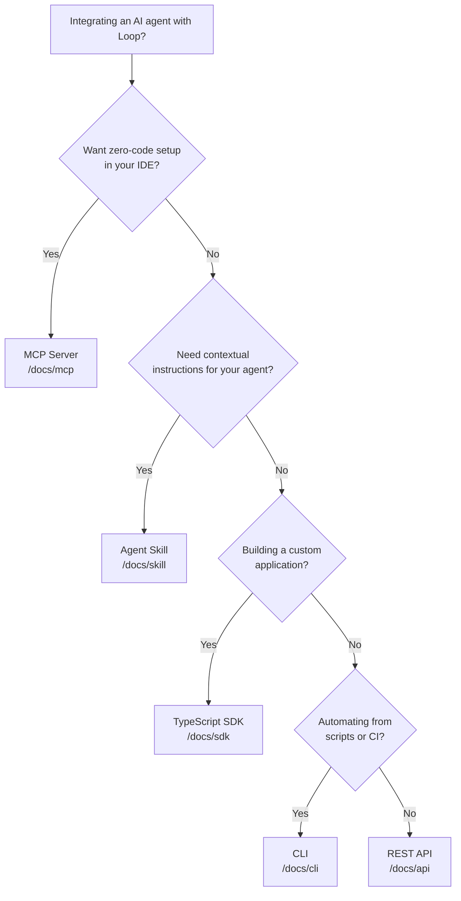
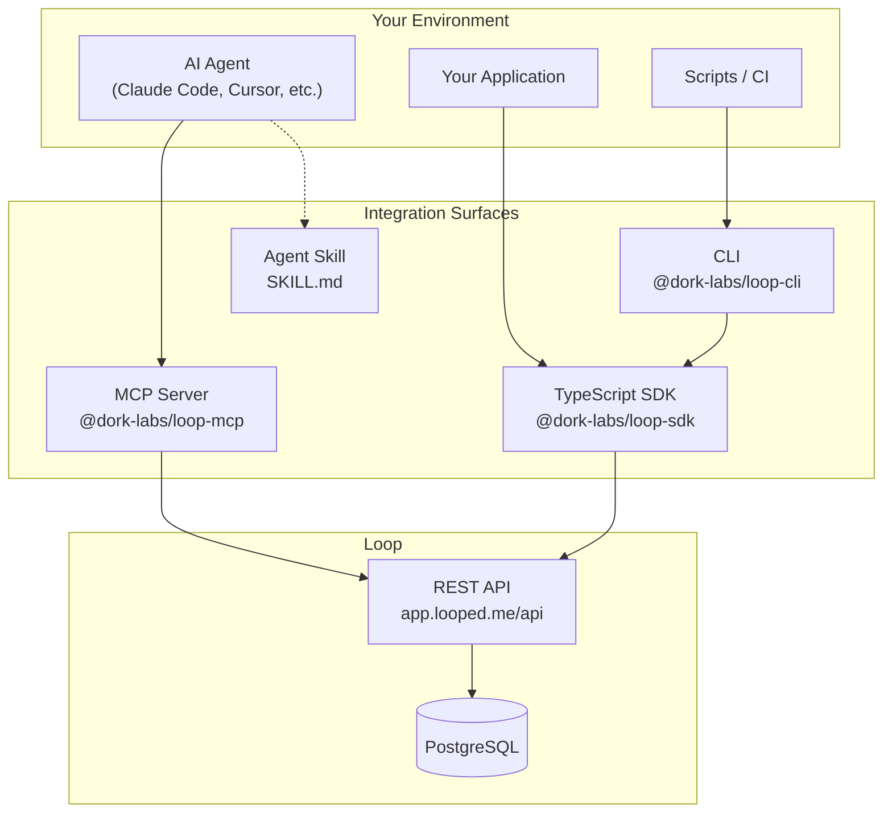

# Documentation Update: Agent Integration Surfaces — Implementation Tasks

**Spec**: [02-specification.md](./02-specification.md)
**Total Tasks**: 18
**Phases**: 6

---

## Phase 1: Navigation Infrastructure + Agent Entry Point

### Task 1.1: [P1] Update root docs navigation and docs landing page

Update the root `docs/meta.json` to add the 4 new sections and update `docs/index.mdx` to add Cards linking to the new sections.

#### Files to modify

**`docs/meta.json`** — Replace the current pages array with:

```json
{
  "title": "Documentation",
  "pages": [
    "getting-started",
    "concepts",
    "agents",
    "mcp",
    "sdk",
    "skill",
    "cli",
    "guides",
    "integrations",
    "api",
    "self-hosting",
    "contributing"
  ]
}
```

**`docs/index.mdx`** — Add 4 new Cards inside the existing `<Cards>` block, after the "CLI Reference" card and before the "Self-Hosting" card. The new cards are:

```mdx
  <Card
    title="Agent Integration"
    description="Choose the right integration surface for your AI agent — Claude Code, Cursor, Windsurf, OpenHands, or custom."
    href="/docs/agents"
  />
  <Card
    title="MCP Server"
    description="Zero-code IDE integration via the Model Context Protocol. Install in one command, get 9 agent tools."
    href="/docs/mcp"
  />
  <Card
    title="TypeScript SDK"
    description="Programmatic access to Loop for custom applications, scripts, and agent frameworks."
    href="/docs/sdk"
  />
  <Card
    title="Agent Skill"
    description="Contextual instructions that teach AI agents how to use Loop effectively in your project."
    href="/docs/skill"
  />
```

#### Acceptance Criteria

- `docs/meta.json` has exactly 12 entries in the pages array in the specified order
- `docs/index.mdx` has 12 Cards total (8 existing + 4 new)
- `npm run build` succeeds (Fumadocs validates page references at build time)

---

### Task 1.2: [P1] Create agents/ section with decision tree landing page

Create the `docs/agents/` directory with nav config and the decision tree landing page.

#### Files to create

**`docs/agents/meta.json`:**

```json
{
  "title": "Agent Integration",
  "pages": ["claude-code", "cursor", "windsurf", "openhands", "custom"]
}
```

**`docs/agents/index.mdx`:**

Page structure:
1. **Frontmatter**: title "Agent Integration", description about choosing integration surfaces
2. **Imports**: `Cards`, `Card` from `fumadocs-ui/components/card`; `Callout` from `fumadocs-ui/components/callout`
3. **Intro paragraph**: "Loop integrates with AI agents through multiple surfaces. Choose the one that fits your workflow, or follow a per-agent guide below."
4. **Mermaid decision tree** — use the exact Mermaid diagram from the spec:



5. **"Per-Agent Guides" heading** with `<Cards>` grid:
   - Claude Code card → `/docs/agents/claude-code`
   - Cursor card → `/docs/agents/cursor`
   - Windsurf card → `/docs/agents/windsurf`
   - OpenHands card → `/docs/agents/openhands`
   - Custom / Any Agent card → `/docs/agents/custom`

6. **"Integration Surfaces" heading** with brief (1-2 sentence) descriptions of each surface:
   - MCP Server — zero-code IDE integration, 9 agent tools, install in one command. Link to `/docs/mcp`
   - TypeScript SDK — programmatic access for custom apps. Link to `/docs/sdk`
   - Agent Skill — contextual instructions via SKILL.md. Link to `/docs/skill`
   - CLI — command-line automation for scripts and CI. Link to `/docs/cli`
   - REST API — direct HTTP access for any language. Link to `/docs/api`

#### Acceptance Criteria

- `docs/agents/meta.json` exists with 5 pages listed
- `docs/agents/index.mdx` renders with Mermaid diagram and Cards grid
- Sidebar shows "Agent Integration" section after "Concepts"

---

### Task 1.3: [P1] Create mcp/, sdk/, skill/ section scaffolding

Create the `meta.json` nav config files for the three remaining new sections so they appear in the sidebar and later tasks can add content pages.

#### Files to create

**`docs/mcp/meta.json`:**

```json
{
  "title": "MCP Server",
  "pages": ["tools", "troubleshooting"]
}
```

**`docs/sdk/meta.json`:**

```json
{
  "title": "TypeScript SDK",
  "pages": ["dispatch", "issues", "signals", "projects", "goals", "templates", "dashboard", "comments", "errors"]
}
```

**`docs/skill/meta.json`:**

```json
{
  "title": "Agent Skill",
  "pages": []
}
```

#### Acceptance Criteria

- All three `meta.json` files exist with correct content
- Sidebar shows "MCP Server", "TypeScript SDK", and "Agent Skill" sections
- `npm run build` succeeds (sections may show as empty until content pages are added)

---

## Phase 2: MCP Server Documentation

### Task 2.1: [P2] Create mcp/index.mdx with tabbed installation instructions

Create the MCP Server overview page with tabbed installation instructions for each IDE/editor.

**Blocked by:** Task 1.3 (mcp/meta.json must exist)

#### Files to create

**`docs/mcp/index.mdx`:**

Page structure:
1. **Frontmatter**: title "MCP Server", description about zero-code IDE integration
2. **Imports**: `Tabs`, `Tab` from `fumadocs-ui/components/tabs`; `Callout` from `fumadocs-ui/components/callout`; `Steps`, `Step` from `fumadocs-ui/components/steps`
3. **Overview** (2-3 sentences): Loop's MCP server gives AI agents direct access to Loop's issue tracking, dispatch queue, and signal ingestion through the Model Context Protocol. Install it in your IDE in one command — no code changes required.
4. **Installation heading** with `<Tabs>` component containing 4 tabs:

   **Tab "Claude Code":**
   ```bash
   claude mcp add loop -- npx -y @dork-labs/loop-mcp
   ```
   Set your API key: `export LOOP_API_KEY=loop_your_key_here`

   **Tab "Cursor":**
   Add to `.cursor/mcp.json`:
   ```json
   {
     "mcpServers": {
       "loop": {
         "command": "npx",
         "args": ["-y", "@dork-labs/loop-mcp"],
         "env": { "LOOP_API_KEY": "loop_your_key_here" }
       }
     }
   }
   ```

   **Tab "Windsurf":**
   Add to `.windsurf/mcp.json` (same JSON structure as Cursor)

   **Tab "Claude Desktop":**
   Add to Claude Desktop config file:
   - macOS: `~/Library/Application Support/Claude/claude_desktop_config.json`
   - Windows: `%APPDATA%\Claude\claude_desktop_config.json`
   Same JSON structure.

5. **Verify Installation** heading: "Ask your agent to run the `loop_get_next_task` tool. If configured correctly, it will return your next priority issue or confirm the queue is empty."
6. **Environment Variables** table:

   | Variable | Required | Default | Description |
   |----------|----------|---------|-------------|
   | `LOOP_API_KEY` | Yes | — | Your `loop_`-prefixed API key |
   | `LOOP_API_URL` | No | `https://app.looped.me` | Loop API base URL (use `http://localhost:5667` for local dev) |

7. **`<Callout type="warn">`** about API key security: `.mcp.json` stores the key on disk. Recommend using environment variable injection via `env:` syntax rather than hardcoded keys. Reference `.mcp.json.example` in the repo.
8. **Next steps** links: Tools Reference (`/docs/mcp/tools`), Troubleshooting (`/docs/mcp/troubleshooting`), Per-agent guides (`/docs/agents`)

#### Content sources to read for accuracy

- `packages/mcp/.mcp.json.example` — verified JSON config format
- `packages/mcp/src/index.ts` — entry point, env var handling
- `packages/mcp/src/stdio.ts` — stdio transport (used by npx)

#### Acceptance Criteria

- Tabs switch correctly between Claude Code, Cursor, Windsurf, Claude Desktop
- JSON config examples match `.mcp.json.example` format
- Environment variables table is accurate
- Security callout present for API key storage

---

### Task 2.2: [P2] Create mcp/tools.mdx with all 9 MCP tools reference

Create the complete MCP tools reference page documenting all 9 agent tools.

**Blocked by:** Task 1.3 (mcp/meta.json must exist)

#### Files to create

**`docs/mcp/tools.mdx`:**

Page structure:
1. **Frontmatter**: title "MCP Tools Reference", description listing all 9 tools
2. **Intro**: "Loop's MCP server exposes 9 tools that cover the complete agent workflow — from claiming tasks to reporting results."
3. **Tools overview table**:

   | Tool | Category | Description |
   |------|----------|-------------|
   | `loop_get_next_task` | Dispatch | Claim the next priority issue with hydrated prompt |
   | `loop_complete_task` | Dispatch | Mark a task as done and report results |
   | `loop_create_issue` | Issues | Create a new issue |
   | `loop_update_issue` | Issues | Update an existing issue |
   | `loop_list_issues` | Issues | List and filter issues |
   | `loop_get_issue` | Issues | Get full issue details |
   | `loop_ingest_signal` | Signals | Send a signal for triage |
   | `loop_create_comment` | Comments | Add a comment to an issue |
   | `loop_get_dashboard` | Dashboard | Get system health metrics |

4. **Per-tool sections** — for each of the 9 tools:
   - Tool name as heading
   - Description (1-2 sentences)
   - Parameters table (name, type, required, description)
   - Example input JSON
   - Example output JSON
   - Cross-link to corresponding SDK method and API endpoint

#### Content sources to read for accuracy

Read EACH tool file in `packages/mcp/src/tools/` to extract exact parameter names, types, descriptions, and Zod schemas:
- `packages/mcp/src/tools/get-next-task.ts`
- `packages/mcp/src/tools/complete-task.ts`
- `packages/mcp/src/tools/create-issue.ts`
- `packages/mcp/src/tools/update-issue.ts`
- `packages/mcp/src/tools/list-issues.ts`
- `packages/mcp/src/tools/get-issue.ts`
- `packages/mcp/src/tools/ingest-signal.ts`
- `packages/mcp/src/tools/create-comment.ts`
- `packages/mcp/src/tools/get-dashboard.ts`

#### Acceptance Criteria

- All 9 tools documented with parameters matching source code
- Every tool has an example input and output
- Cross-links to SDK and API present for each tool

---

### Task 2.3: [P2] Create mcp/troubleshooting.mdx

Create the MCP troubleshooting page covering common errors and debugging steps.

**Blocked by:** Task 1.3 (mcp/meta.json must exist)

#### Files to create

**`docs/mcp/troubleshooting.mdx`:**

Page structure:
1. **Frontmatter**: title "MCP Troubleshooting", description
2. **Common issues** — each as a heading with problem/solution format:
   - **"Server not found" or "spawn npx ENOENT"**: Node.js not in PATH, npx not available. Solution: verify Node.js 18+ installed, check PATH.
   - **"Unauthorized" / 401 error**: API key missing or invalid. Solution: verify LOOP_API_KEY env var is set, key has `loop_` prefix, key is valid.
   - **"Connection refused" / ECONNREFUSED**: API URL wrong or server not running. Solution: check LOOP_API_URL, verify API is running at that URL.
   - **Tools not appearing in IDE**: MCP config file in wrong location or malformed JSON. Solution: verify `.mcp.json` / `mcp.json` path per IDE, validate JSON syntax.
   - **"No task available" on every call**: Dispatch queue empty or all issues blocked. Solution: create a test issue, check issue statuses.
3. **Debugging steps** heading:
   - How to test MCP server manually: `LOOP_API_KEY=loop_xxx npx @dork-labs/loop-mcp` (runs in stdio mode)
   - How to verify API connectivity: `curl -H "Authorization: Bearer loop_xxx" https://app.looped.me/api/dispatch/queue`
   - How to check `.mcp.json` format: reference `.mcp.json.example` in the repo
4. **Environment variables** recap table (same as mcp/index.mdx)
5. **Cross-links**: MCP Overview (`/docs/mcp`), API Keys (`/docs/getting-started/api-keys`), Per-agent guides (`/docs/agents`)

#### Content sources

- `packages/mcp/src/tools/error-handler.ts` — error handling patterns
- `packages/mcp/src/client.ts` — HTTP client error handling

#### Acceptance Criteria

- Covers at least 5 common error scenarios
- Includes manual debugging commands
- Cross-links to related pages

---

## Phase 3: Per-Agent Integration Guides

### Task 3.1: [P3] Create agents/claude-code.mdx integration guide

**Blocked by:** Task 1.2 (agents/meta.json), Task 2.1 (MCP docs to cross-link)

#### Files to create

**`docs/agents/claude-code.mdx`:**

Page structure (follows the per-agent guide template from spec):
1. **Frontmatter**: title "Loop + Claude Code", description
2. **Imports**: `Steps`, `Step` from `fumadocs-ui/components/steps`; `Callout` from `fumadocs-ui/components/callout`; `Tabs`, `Tab` from `fumadocs-ui/components/tabs`
3. **Prerequisites**: API key (link to `/docs/getting-started/api-keys`), Claude Code installed
4. **`<Steps>` component** with numbered steps:

   **Step 1: Get an API Key**
   Link to API keys page. Mention `npx @dork-labs/loop-connect` as quickest path.

   **Step 2: Install MCP Server**
   ```bash
   claude mcp add loop -- npx -y @dork-labs/loop-mcp
   ```
   Set environment variable: `export LOOP_API_KEY=loop_your_key_here`
   Cross-link to `/docs/mcp` for details.

   **Step 3: Load Agent Skill** (optional)
   ```bash
   npm install @dork-labs/loop
   ```
   Creates `SKILL.md` in project root. Claude Code reads it for contextual instructions.
   Cross-link to `/docs/skill`.

   **Step 4: Verify Connection**
   Ask Claude Code: "Use the loop_get_next_task tool to check if Loop is connected."
   Expected: either a task or "queue is empty" confirmation.

   **Step 5: Your First Dispatch Cycle**
   1. Create a test issue via SDK or CLI
   2. Ask Claude Code: "Get my next Loop task and work on it"
   3. Agent claims task, reads instructions, executes, reports completion

5. **Troubleshooting** section with Claude Code-specific issues:
   - MCP server not appearing in `claude mcp list`
   - API key not being picked up from environment
6. **Next Steps** links: MCP Tools Reference, SDK Reference, Dashboard Guide, Concepts

#### Acceptance Criteria

- Complete end-to-end flow from API key to first dispatch
- Steps use `<Steps>` component for numbered rendering
- Cross-links to MCP, Skill, API Keys pages
- Claude Code-specific commands are accurate

---

### Task 3.2: [P3] Create agents/cursor.mdx integration guide

**Blocked by:** Task 1.2 (agents/meta.json), Task 2.1 (MCP docs to cross-link)

#### Files to create

**`docs/agents/cursor.mdx`:**

Same template as claude-code.mdx with Cursor-specific details:

1. **Frontmatter**: title "Loop + Cursor"
2. **Prerequisites**: API key, Cursor IDE installed
3. **`<Steps>` component**:

   **Step 1: Get an API Key** — same as Claude Code guide

   **Step 2: Install MCP Server**
   Create `.cursor/mcp.json` in project root:
   ```json
   {
     "mcpServers": {
       "loop": {
         "command": "npx",
         "args": ["-y", "@dork-labs/loop-mcp"],
         "env": { "LOOP_API_KEY": "loop_your_key_here" }
       }
     }
   }
   ```
   Cross-link to `/docs/mcp`.

   **Step 3: Load Cursor Rules** (optional)
   ```bash
   npm install @dork-labs/loop
   ```
   Creates `.cursor/rules/loop.mdc` with Loop-specific rules for Cursor's agent.
   Cross-link to `/docs/skill`.

   **Step 4: Verify Connection** — same pattern as Claude Code

   **Step 5: Your First Dispatch Cycle** — same pattern

4. **Troubleshooting**: Cursor-specific issues (`.cursor/mcp.json` path, Cursor restart needed after config change)
5. **Next Steps**: same links

#### Content sources

- `packages/loop-skill/` — Cursor rules file location and content

#### Acceptance Criteria

- `.cursor/mcp.json` config matches `.mcp.json.example` format
- Cursor-specific paths and behaviors documented
- Complete end-to-end flow

---

### Task 3.3: [P3] Create agents/windsurf.mdx integration guide

**Blocked by:** Task 1.2 (agents/meta.json), Task 2.1 (MCP docs to cross-link)

#### Files to create

**`docs/agents/windsurf.mdx`:**

Same template with Windsurf-specific details:

1. **Frontmatter**: title "Loop + Windsurf"
2. **Prerequisites**: API key, Windsurf IDE installed
3. **`<Steps>` component**:

   **Step 1: Get an API Key**

   **Step 2: Install MCP Server**
   Add to Windsurf MCP configuration (`.windsurf/mcp.json` or via Windsurf settings):
   ```json
   {
     "mcpServers": {
       "loop": {
         "command": "npx",
         "args": ["-y", "@dork-labs/loop-mcp"],
         "env": { "LOOP_API_KEY": "loop_your_key_here" }
       }
     }
   }
   ```

   **Step 3: Verify Connection**

   **Step 4: Your First Dispatch Cycle**

4. **Troubleshooting**: Windsurf-specific issues
5. **Next Steps**

Note: Windsurf does not currently support Agent Skill loading (no Step 3 for skill). Document this limitation.

#### Acceptance Criteria

- Windsurf-specific MCP config path documented
- Notes that skill loading is not yet supported in Windsurf
- Complete end-to-end flow

---

### Task 3.4: [P3] Create skill/index.mdx agent skill documentation

**Blocked by:** Task 1.3 (skill/meta.json must exist)

#### Files to create

**`docs/skill/index.mdx`:**

Page structure:
1. **Frontmatter**: title "Agent Skill", description about contextual instructions for AI agents
2. **Imports**: `Tabs`, `Tab` from `fumadocs-ui/components/tabs`; `Callout` from `fumadocs-ui/components/callout`
3. **Overview**: What is the Loop agent skill? Contextual instructions packaged as a content-only npm module that teaches AI agents how to use Loop effectively. Unlike MCP (which gives agents tools), the skill gives agents knowledge about Loop's concepts and workflows.
4. **MCP vs Skill comparison** — brief callout explaining when to use each:
   - MCP Server = tools (actions the agent can take)
   - Agent Skill = knowledge (instructions the agent reads for context)
   - Best practice: install both for optimal agent experience
5. **Installation**:
   ```bash
   npm install @dork-labs/loop
   ```
6. **What gets installed** — `<Tabs>` showing per-editor artifacts:

   **Tab "Claude Code":** `SKILL.md` in project root — Claude Code reads this automatically
   **Tab "Cursor":** `.cursor/rules/loop.mdc` — Cursor loads this as a rule
   **Tab "OpenHands":** `.openhands/microagents/loop.md` — OpenHands microagent format

7. **Customization**: How to modify SKILL.md for project-specific instructions. It is a static file that can be edited.
8. **How it works**: The package uses npm `postinstall` to copy files. No runtime dependencies, no code execution, content-only.
9. **Cross-links**: MCP Server (`/docs/mcp`), Per-agent guides (`/docs/agents`), ADR 0028 for design rationale

#### Content sources

- `packages/loop-skill/SKILL.md` — actual skill content
- `packages/loop-skill/package.json` — postinstall script
- `packages/loop-skill/README.md` — distribution details

#### Acceptance Criteria

- Clear distinction between MCP (tools) and Skill (knowledge)
- Per-editor artifact locations documented with Tabs
- Installation command and what gets created is accurate

---

## Phase 4: SDK Reference

### Task 4.1: [P4] Create sdk/index.mdx with LoopClient overview and resource map

**Blocked by:** Task 1.3 (sdk/meta.json must exist)

#### Files to create

**`docs/sdk/index.mdx`:**

Page structure:
1. **Frontmatter**: title "TypeScript SDK", description
2. **Imports**: `Callout` from `fumadocs-ui/components/callout`
3. **Overview**: The Loop TypeScript SDK (`@dork-labs/loop-sdk`) provides type-safe programmatic access to Loop's API for custom applications, scripts, and agent frameworks.
4. **Installation**:
   ```bash
   npm install @dork-labs/loop-sdk
   ```
5. **Quick start** code example:
   ```typescript
   import { LoopClient } from '@dork-labs/loop-sdk'

   const loop = new LoopClient({
     apiKey: process.env.LOOP_API_KEY,
   })

   // Get the next task from the dispatch queue
   const task = await loop.dispatch.next()
   if (task) {
     console.log(task.issue.title)
     console.log(task.prompt)
   }
   ```
6. **Configuration options** — `LoopClient` constructor params:

   | Option | Type | Required | Default | Description |
   |--------|------|----------|---------|-------------|
   | `apiKey` | `string` | Yes | — | Your `loop_`-prefixed API key |
   | `baseUrl` | `string` | No | `https://app.looped.me` | Loop API base URL |

7. **Resource map table** — exactly as specified in the spec (11 resources with descriptions and key methods), each resource name linking to its dedicated page
8. **Error handling** brief intro linking to `/docs/sdk/errors`
9. **Cross-links**: MCP Server (for zero-code alternative), CLI (for command-line use), API Reference (for raw HTTP)

#### Content sources

- `packages/sdk/src/client.ts` — LoopClient class, constructor options
- `packages/sdk/src/index.ts` — public exports
- `packages/sdk/src/http.ts` — HTTP client config

#### Acceptance Criteria

- Installation command accurate
- LoopClient constructor options match source code
- Resource map lists all 11 resources with correct method names
- Quick start example is runnable

---

### Task 4.2: [P4] Create sdk/dispatch.mdx — core agent workflow reference

**Blocked by:** Task 1.3 (sdk/meta.json must exist)

#### Files to create

**`docs/sdk/dispatch.mdx`:**

Page structure (follows SDK resource page template from spec):
1. **Frontmatter**: title "Dispatch", description "Core agent feedback loop — claim work and report results"
2. **Purpose**: The dispatch resource is Loop's core agent workflow. Agents call `dispatch.next()` to claim the highest-priority unblocked issue with hydrated prompt instructions, then report results when complete.
3. **Import + setup reminder**:
   ```typescript
   import { LoopClient } from '@dork-labs/loop-sdk'
   const loop = new LoopClient({ apiKey: process.env.LOOP_API_KEY })
   ```
4. **Methods table**:

   | Method | Parameters | Return Type | Description |
   |--------|-----------|-------------|-------------|
   | `next(params?)` | `DispatchNextParams` | `DispatchNextResponse \| null` | Atomically claim the highest-priority unblocked issue |
   | `queue(params?)` | `DispatchQueueParams` | `PaginatedList<DispatchQueueItem>` | Preview the priority queue without claiming |

5. **`next()` section**:
   - Full method signature with TypeScript types
   - Parameters table: `projectId` (string, optional — filter by project)
   - Returns `null` when queue is empty (HTTP 204)
   - Code example:
     ```typescript
     const task = await loop.dispatch.next()
     if (task) {
       console.log(task.issue.title)
       console.log(task.prompt) // hydrated instructions
     }
     ```
   - Response shape: `{ issue: Issue, prompt: string }`

6. **`queue()` section**:
   - Parameters: `projectId`, `limit`, `offset` (all optional)
   - Returns `PaginatedList<DispatchQueueItem>` with `.items` and `.total`
   - Code example:
     ```typescript
     const queue = await loop.dispatch.queue({ limit: 10 })
     console.log(`${queue.total} items in queue`)
     for (const item of queue.items) {
       console.log(item.issue.title, item.score)
     }
     ```

7. **The Agent Polling Loop** — complete example showing the dispatch cycle:
   ```typescript
   async function agentLoop(loop: LoopClient) {
     while (true) {
       const task = await loop.dispatch.next()
       if (!task) {
         await sleep(60_000) // wait 1 minute
         continue
       }
       // ... execute task ...
       await loop.issues.update(task.issue.id, { status: 'done' })
     }
   }
   ```

8. **Cross-links**: MCP `loop_get_next_task` tool, API `GET /api/dispatch/next`, Concepts: Dispatch

#### Content sources

- `packages/sdk/src/resources/dispatch.ts` — exact method signatures, parameter types, JSDoc
- `packages/types/src/dispatch.ts` (or wherever DispatchNextParams/DispatchQueueParams are defined)

#### Acceptance Criteria

- Method signatures match source code exactly
- Both methods documented with parameters and return types
- Agent polling loop example included
- Cross-links to MCP tool and API endpoint

---

### Task 4.3: [P4] Create sdk/issues.mdx — issues resource reference

**Blocked by:** Task 1.3 (sdk/meta.json must exist)

#### Files to create

**`docs/sdk/issues.mdx`:**

Page structure (follows SDK resource template):
1. **Frontmatter**: title "Issues", description
2. **Purpose**: Issues are the atomic unit of work in Loop. Create, read, update, and delete issues programmatically.
3. **Import + setup reminder**
4. **Methods table**: `list()`, `get()`, `create()`, `update()`, `delete()` with parameter types and return types
5. **Per-method sections** each with:
   - Method signature
   - Parameters table (all params with types, required/optional, descriptions)
   - Code example with realistic data
   - Return type with example response shape
6. **Filtering and pagination** — show `list()` with filters:
   ```typescript
   const bugs = await loop.issues.list({
     status: 'open',
     type: 'bug',
     projectId: 'proj_abc123',
     limit: 25,
   })
   ```
7. **Error handling callout**: 404 on get/update/delete for non-existent issues
8. **Cross-links**: MCP `loop_create_issue`/`loop_update_issue`/`loop_list_issues`/`loop_get_issue`, API endpoints

#### Content sources

- `packages/sdk/src/resources/issues.ts` — exact method signatures, types
- `packages/types/src/issues.ts` — Issue type, create/update params

#### Acceptance Criteria

- All 5 CRUD methods documented
- Filter parameters for `list()` are complete
- Every method has a runnable code example
- Parameter types match source

---

### Task 4.4: [P4] Create remaining SDK resource pages (7 pages)

**Blocked by:** Task 1.3 (sdk/meta.json must exist)

Create the remaining 7 SDK resource documentation pages, each following the standard SDK resource template from the spec.

#### Files to create

**`docs/sdk/signals.mdx`:**
- Title: "Signals"
- Purpose: Ingest external signals (errors, metrics, feedback) that create issues for triage
- Methods: `ingest()` — accepts signal data with source, type, and payload
- Source: `packages/sdk/src/resources/signals.ts`
- Code example showing PostHog metric signal ingestion

**`docs/sdk/projects.mdx`:**
- Title: "Projects"
- Purpose: Group issues toward shared objectives
- Methods: `list()`, `get()`, `create()`, `update()`, `delete()`
- Source: `packages/sdk/src/resources/projects.ts`

**`docs/sdk/goals.mdx`:**
- Title: "Goals"
- Purpose: Measurable success indicators attached to projects
- Methods: `list()`, `get()`, `create()`, `update()`, `delete()`
- Source: `packages/sdk/src/resources/goals.ts`

**`docs/sdk/templates.mdx`:**
- Title: "Templates"
- Purpose: Versioned prompt instructions for agent dispatch
- Methods: `list()`, `get()`, `create()`, `update()`, `delete()` plus version management (`listVersions()`, `createVersion()`, `promoteVersion()`) and reviews (`listReviews()`)
- Source: `packages/sdk/src/resources/templates.ts`

**`docs/sdk/dashboard.mdx`:**
- Title: "Dashboard"
- Purpose: System health metrics and activity feed
- Methods: `stats()`, `activity()`, `prompts()`
- Source: `packages/sdk/src/resources/dashboard.ts`

**`docs/sdk/comments.mdx`:**
- Title: "Comments & Relations"
- Purpose: Threaded issue discussion and issue dependency management
- Methods: Comments: `list()`, `create()`. Relations: `create()`, `delete()`
- Sources: `packages/sdk/src/resources/comments.ts`, `packages/sdk/src/resources/relations.ts`

**`docs/sdk/errors.mdx`:**
- Title: "Error Handling"
- Purpose: Error classes, retry behavior, and error handling patterns
- Content: Document error classes (`LoopError`, `LoopApiError`, `LoopAuthError`, `LoopNotFoundError`, etc.), HTTP status code mapping, retry strategies, try/catch patterns
- Source: `packages/sdk/src/errors.ts`

#### Template for each page

Each page follows this structure:
1. Frontmatter (title, description)
2. Purpose (1 sentence)
3. Import + setup reminder
4. Methods table
5. Per-method sections with signature, parameters, code example, return type
6. Error handling callout
7. Cross-links to MCP tools and API endpoints

#### Acceptance Criteria

- All 7 files created
- Method signatures match source code in each respective resource file
- Every method has at least one code example
- Cross-links to corresponding API endpoints and MCP tools where applicable

---

## Phase 5: Getting Started Rewrite + API Keys

### Task 5.1: [P5] Rewrite getting-started/quickstart.mdx with connect CLI flow

**Blocked by:** Task 2.1 (MCP docs to cross-link), Task 4.1 (SDK docs to cross-link)

#### Files to modify

**`docs/getting-started/quickstart.mdx`** — Full rewrite with new flow:

Page structure:
1. **Frontmatter**: title "Quickstart", description "Get Loop running in under 5 minutes"
2. **Imports**: `Steps`, `Step` from `fumadocs-ui/components/steps`; `Tabs`, `Tab` from `fumadocs-ui/components/tabs`; `Callout` from `fumadocs-ui/components/callout`
3. **Intro**: Get from zero to your first dispatch cycle in under 5 minutes.
4. **`<Steps>` component** with 5 steps:

   **Step 1: Get an API Key**
   From the dashboard at `https://app.looped.me`, or generate one locally with `npm run setup`.
   Link to `/docs/getting-started/api-keys` for details.

   **Step 2: Connect Your Project**
   ```bash
   npx @dork-labs/loop-connect
   ```
   Single command that auto-detects your environment, configures MCP for your IDE, and installs the agent skill.
   Link to `/docs/guides/connect-cli` for detailed walkthrough.

   **Step 3: Create Your First Issue**
   ```typescript
   import { LoopClient } from '@dork-labs/loop-sdk'

   const loop = new LoopClient({ apiKey: process.env.LOOP_API_KEY })

   await loop.issues.create({
     title: 'Add input validation to signup form',
     type: 'task',
   })
   ```

   **Step 4: Run the Dispatch Loop**
   ```typescript
   const task = await loop.dispatch.next()
   if (task) {
     console.log(task.issue.title)  // "Add input validation to signup form"
     console.log(task.prompt)        // hydrated instructions
   }
   ```

   **Step 5: Complete the Task**
   After the agent finishes work:
   ```typescript
   await loop.issues.update(task.issue.id, { status: 'done' })
   ```
   The loop continues — new signals create new issues, agents claim and complete them.

5. **What's Next** section with links:
   - Set up your IDE → `/docs/agents` (choose your agent)
   - Explore the SDK → `/docs/sdk`
   - Learn the concepts → `/docs/concepts`
   - Connect integrations → `/docs/integrations`

#### Acceptance Criteria

- Flow is: API key → connect CLI → create issue → dispatch → complete
- All code examples use `@dork-labs/loop-sdk`
- Steps component renders numbered steps
- Cross-links to agents, SDK, and concepts pages

---

### Task 5.2: [P5] Create getting-started/api-keys.mdx and update authentication.mdx

**Blocked by:** Task 2.1 (MCP docs reference api-keys)

#### Files to create

**`docs/getting-started/api-keys.mdx`:**

Page structure:
1. **Frontmatter**: title "API Keys", description "Generate and manage Loop API keys"
2. **Imports**: `Callout` from `fumadocs-ui/components/callout`; `Steps`, `Step` from `fumadocs-ui/components/steps`
3. **Overview**: Loop uses `loop_`-prefixed API keys for authentication across all integration surfaces (SDK, CLI, MCP, REST API).
4. **Key format**: All keys start with `loop_` prefix for easy identification. Example: `loop_abc123def456...`
5. **Generating keys** — `<Steps>`:
   - **Option A: Connect CLI** (recommended): `npx @dork-labs/loop-connect` — auto-generates and configures
   - **Option B: Dashboard**: Navigate to app.looped.me settings
   - **Option C: Environment variable**: Set `LOOP_API_KEY` manually
6. **Using your key** — brief per-surface examples:
   - SDK: `new LoopClient({ apiKey: process.env.LOOP_API_KEY })`
   - CLI: `loop auth login`
   - MCP: `env.LOOP_API_KEY` in `.mcp.json`
   - REST API: `Authorization: Bearer loop_your_key`
7. **`<Callout type="warn">`** Security best practices:
   - Never commit keys to source control
   - Use environment variables, not hardcoded strings
   - Avoid passing `--api-key` in CLI commands (appears in shell history)
   - Rotate keys if compromised
8. **Cross-links**: Authentication (`/docs/getting-started/authentication`), MCP Setup (`/docs/mcp`), SDK Setup (`/docs/sdk`)

#### Files to modify

**`docs/getting-started/authentication.mdx`** — Add a new section about the `loop_` key format:
- Add paragraph explaining the `loop_` prefix format (per ADR 0023)
- Add link to the new API Keys page for key generation details
- Keep existing webhook auth content unchanged

**`docs/getting-started/meta.json`** — Update pages array:

```json
{
  "title": "Getting Started",
  "pages": ["quickstart", "authentication", "api-keys"]
}
```

#### Content sources

- `apps/api/src/env.ts` — API key validation (loop_ prefix)
- `decisions/0023-use-loop-prefix-for-api-keys.md` — ADR for key format

#### Acceptance Criteria

- `api-keys.mdx` covers generation, usage across surfaces, and security
- `authentication.mdx` updated with `loop_` format details and cross-link
- `meta.json` includes `api-keys` in pages array
- Security callout present

---

### Task 5.3: [P5] Rewrite getting-started/index.mdx with choose-your-path cards

**Blocked by:** Task 2.1 (MCP docs), Task 4.1 (SDK docs)

#### Files to modify

**`docs/getting-started/index.mdx`** — Rewrite with choose-your-path pattern:

Page structure:
1. **Frontmatter**: title "Getting Started", description "Choose your path to start using Loop"
2. **Imports**: `Cards`, `Card` from `fumadocs-ui/components/card`; `Callout` from `fumadocs-ui/components/callout`
3. **Intro**: Welcome to Loop. Choose the path that matches your use case.
4. **`<Cards>` grid** with 4 paths:

   **Quickstart** — "Get Loop running in under 5 minutes with the connect CLI"
   → `/docs/getting-started/quickstart`

   **Agent Setup** — "Connect your AI agent (Claude Code, Cursor, Windsurf, OpenHands)"
   → `/docs/agents`

   **SDK Reference** — "Build custom applications with the TypeScript SDK"
   → `/docs/sdk`

   **API Reference** — "Direct HTTP access for any language or platform"
   → `/docs/api`

5. **Prerequisites** section:
   - Node.js 18+
   - An API key (link to `/docs/getting-started/api-keys`)

#### Acceptance Criteria

- Index page shows 4 clear path cards
- Each card links to the correct destination
- Prerequisites listed

---

## Phase 6: CLI Updates + Architecture + Remaining Pages

### Task 6.1: [P6] Create new CLI documentation pages and update cli/meta.json

**Blocked by:** Task 1.1 (root nav must be updated)

#### Files to create

**`docs/cli/auth.mdx`:**
- Title: "Authentication"
- Document `loop auth login`, `loop auth logout`, `loop auth status` commands
- Source: `apps/cli/src/commands/auth.ts`
- Include usage examples, options, and output format

**`docs/cli/dashboard.mdx`:**
- Title: "Dashboard"
- Document `loop dashboard` command
- Source: `apps/cli/src/commands/dashboard.ts`
- Include usage examples and output format

**`docs/cli/labels.mdx`:**
- Title: "Labels"
- Document `loop labels list`, `loop labels create`, `loop labels delete` commands
- Source: `apps/cli/src/commands/labels.ts`
- Include usage examples

**`docs/cli/completions.mdx`:**
- Title: "Shell Completions"
- Document shell completion setup for bash, zsh, fish
- Source: `apps/cli/src/commands/completions.ts`
- Include installation commands per shell

#### Files to modify

**`docs/cli/meta.json`** — Update pages array:

```json
{
  "title": "CLI Reference",
  "pages": ["issues", "signals", "triage", "templates", "dispatch", "status", "auth", "dashboard", "labels", "completions"]
}
```

#### Acceptance Criteria

- All 4 new CLI pages created with command syntax and examples
- Commands match source code in `apps/cli/src/commands/`
- `meta.json` updated with all 10 pages

---

### Task 6.2: [P6] Create concepts/architecture.mdx with Mermaid diagram

**Blocked by:** Task 1.1 (root nav)

#### Files to create

**`docs/concepts/architecture.mdx`:**

Page structure:
1. **Frontmatter**: title "Architecture Overview", description "How Loop's integration surfaces relate"
2. **Mermaid diagram** — exact diagram from spec showing:
   - "Your Environment" subgraph: AI Agent, Your Application, Scripts/CI
   - "Integration Surfaces" subgraph: MCP Server, SDK, CLI, Skill
   - "Loop" subgraph: REST API, PostgreSQL
   - Connections: Agent→MCP, Agent-.->Skill, App→SDK, Script→CLI, MCP→API, SDK→API, CLI→SDK, API→DB



3. **Surface comparison table**:

   | Surface | Best For | Protocol | Auth | Requires Code? |
   |---------|----------|----------|------|---------------|
   | MCP Server | IDE-based agents | MCP (stdio) | LOOP_API_KEY env | No |
   | TypeScript SDK | Custom apps | HTTP | Constructor param | Yes |
   | CLI | Scripts, CI | Shell | `loop auth login` | No |
   | Agent Skill | Context loading | File system | N/A | No |
   | REST API | Any language | HTTP | Bearer token | Yes |

4. **Pull architecture** explanation: Loop never pushes work to agents. Agents poll `dispatch.next()` on a schedule. This means Loop never needs to know how to reach your agent.
5. **The dispatch loop** explained: How `dispatch.next()` evaluates the backlog — filtering blocked issues, scoring by priority/goal alignment/age — and returns the single highest-priority item with instructions.
6. **Cross-links**: Each surface section in docs, Concepts: Dispatch

#### Files to modify

**`docs/concepts/meta.json`** — Update pages array:

```json
{
  "title": "Concepts",
  "pages": ["issues", "signals", "dispatch", "prompts", "projects-and-goals", "architecture"]
}
```

#### Acceptance Criteria

- Mermaid diagram renders showing all surfaces and connections
- Comparison table covers all 5 surfaces
- Pull architecture explained
- `meta.json` updated

---

### Task 6.3: [P6] Create agents/openhands.mdx and agents/custom.mdx

**Blocked by:** Task 1.2 (agents/meta.json), Task 2.1 (MCP docs)

#### Files to create

**`docs/agents/openhands.mdx`:**

Page structure (follows per-agent guide template):
1. **Frontmatter**: title "Loop + OpenHands"
2. **Prerequisites**: API key, OpenHands installed
3. **`<Steps>` component**:

   **Step 1: Get an API Key**

   **Step 2: Install MCP Server**
   Configure MCP in OpenHands settings (if supported). Otherwise, use SDK directly.

   **Step 3: Load Microagent**
   ```bash
   npm install @dork-labs/loop
   ```
   Creates `.openhands/microagents/loop.md` — OpenHands reads this as a microagent.
   Cross-link to `/docs/skill`.

   **Step 4: Verify Connection**

   **Step 5: Your First Dispatch Cycle**

4. **Troubleshooting**: OpenHands-specific issues
5. **Next Steps**

#### Content sources

- `packages/loop-skill/templates/openhands-loop.md` — OpenHands microagent template

**`docs/agents/custom.mdx`:**

Page structure:
1. **Frontmatter**: title "Custom Agent Integration", description "Connect any AI agent to Loop"
2. **Imports**: `Tabs`, `Tab` from `fumadocs-ui/components/tabs`; `Callout` from `fumadocs-ui/components/callout`
3. **Overview**: Any agent that can make HTTP calls can work with Loop. This guide shows the generic integration pattern.
4. **The Dispatch Pattern** — explain the poll-execute-report cycle
5. **Implementation examples** in `<Tabs>`:

   **Tab "TypeScript (SDK)":**
   ```typescript
   import { LoopClient } from '@dork-labs/loop-sdk'
   const loop = new LoopClient({ apiKey: 'loop_your_key_here' })

   const task = await loop.dispatch.next()
   if (task) {
     // ... execute task.prompt ...
     await loop.issues.update(task.issue.id, { status: 'done' })
   }
   ```

   **Tab "curl (REST API)":**
   ```bash
   # Claim next task
   curl -H "Authorization: Bearer loop_your_key_here" \
     https://app.looped.me/api/dispatch/next

   # Complete task
   curl -X PATCH -H "Authorization: Bearer loop_your_key_here" \
     -H "Content-Type: application/json" \
     -d '{"status": "done"}' \
     https://app.looped.me/api/issues/{id}
   ```

6. **Polling strategy**: Recommended poll interval (60 seconds), exponential backoff on empty queue
7. **Cross-links**: SDK Reference, API Reference, MCP Server (for IDE-based agents)

#### Acceptance Criteria

- OpenHands guide references correct microagent file path
- Custom guide shows both SDK and curl examples
- Polling strategy documented

---

### Task 6.4: [P6] Create guide pages and update integrations/index.mdx

**Blocked by:** Task 1.1 (root nav)

#### Files to create

**`docs/guides/connect-cli.mdx`:**
- Title: "Connect CLI"
- Tutorial walkthrough of `npx @dork-labs/loop-connect`
- What it does: prompts for API key, detects IDE, configures MCP, installs skill
- Step-by-step with expected output at each stage
- Source: reference the connect CLI package (check for README or source)
- Cross-links: API Keys, MCP Setup, Agent Skill

**`docs/guides/agent-polling-loop.mdx`:**
- Title: "Building an Agent Polling Loop"
- How-to guide for building an autonomous agent that continuously polls Loop
- Complete TypeScript example:
  ```typescript
  import { LoopClient } from '@dork-labs/loop-sdk'

  const loop = new LoopClient({ apiKey: process.env.LOOP_API_KEY })

  async function poll() {
    const task = await loop.dispatch.next()
    if (!task) return

    console.log(`Working on: ${task.issue.title}`)
    // ... execute the task using task.prompt as instructions ...
    await loop.issues.update(task.issue.id, { status: 'done' })
    await loop.comments.create(task.issue.id, {
      body: 'Task completed successfully.',
      author: 'agent',
    })
  }

  // Poll every 60 seconds
  setInterval(poll, 60_000)
  poll() // run immediately on start
  ```
- Error handling patterns (retry on failure, exponential backoff)
- Signal ingestion (reporting errors back as signals)
- Cross-links: SDK Dispatch, Concepts: Dispatch, MCP (for zero-code alternative)

#### Files to modify

**`docs/guides/meta.json`** — Update pages array:

```json
{
  "title": "Guides",
  "pages": ["dashboard", "writing-templates", "connect-cli", "agent-polling-loop"]
}
```

**`docs/integrations/index.mdx`** — Add a new section or paragraph near the top that cross-links to the agents/ section:
- Add text like: "Looking to connect an AI agent? See the [Agent Integration](/docs/agents) guide for per-agent setup instructions for Claude Code, Cursor, Windsurf, and OpenHands."
- Keep all existing integration content (GitHub, Sentry, PostHog) unchanged

#### Acceptance Criteria

- Connect CLI guide has step-by-step walkthrough
- Agent polling loop guide has complete runnable example
- `guides/meta.json` updated with 4 pages
- `integrations/index.mdx` has cross-link to agents section

---

## Verification Checklist

After all phases are complete:

1. **Build**: `npm run build` succeeds with 0 errors
2. **Navigation**: Sidebar shows 12 sections in correct order
3. **Links**: All internal cross-links resolve (Fumadocs reports broken links at build)
4. **Content accuracy**: MCP tool names, SDK method signatures, and CLI commands match source code
5. **Components**: Mermaid diagrams render, Tabs switch, Steps render numbered
6. **Security**: Every page with API keys uses `loop_your_key_here` placeholder and has security callout
7. **Page count**: 33 new files created, 8+ existing files updated
